# old-time-maps

Old sheets, put back on the earth.

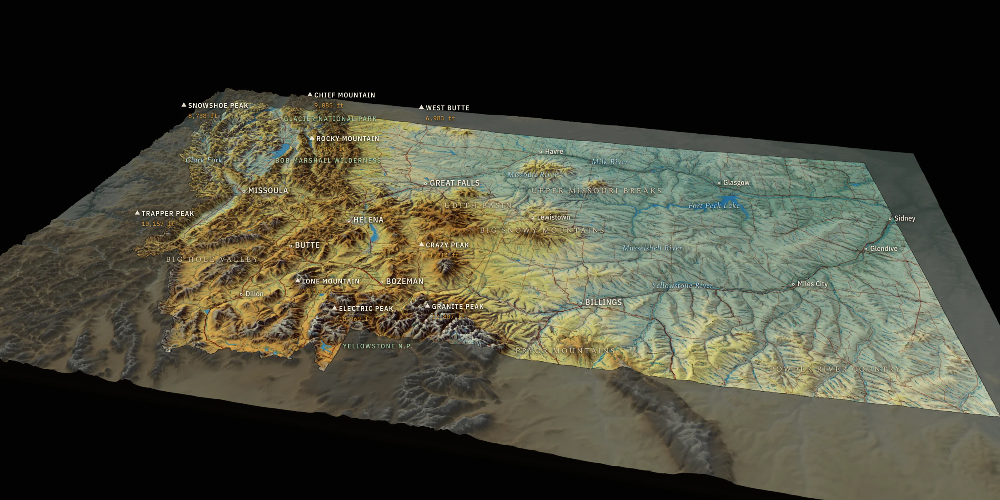

<sub>*Montana in Relief* — the 1991 sheet on its own terrain, looking north at ×5 vertical exaggeration, with the sun in the northwest where the engraver put it.</sub>

Each sheet in this repository is a self-contained project: a pipeline that
georeferences a scan **without hand-picked control points**, and a one-file
WebGL build you can open straight from disk. There are twenty-five draped
sheets — eleven spanning a century and a quarter of Montana cartography,
four reaching into Washington, Idaho, Colorado and Alaska, and ten of the
national parks as their surveyors first drew them — plus a wing of flat
art:

| | sheet | year | the trick that georeferences it |
|---|---|---|---|
| [`gold/`](gold/) | *The Gold Regions* — W.W. de Lacy's map of Montana Territory | 1865 | border-tick combs; the degree labelling is chosen by laying the surveyed state boundary along his red territory line (it agrees to 98 %) |
| [`missouri/`](missouri/) | *The Head of Navigation* — the Great Falls and Fort Benton degree sheets, the steamboat river | 1886 & 1890 | the degree sheets carry their own georeference; the 1890 Cascade County plat is anchor-seeded and correlated at ~1 km |
| [`paradise/`](paradise/) | *The Livingston Sheet* — Folio 1 of the Geologic Atlas: Paradise Valley, Tom Miner Basin, the Boulder and the Crazies | 1894 | the folio plate is correlated against the already-georeferenced 1891 degree sheet on the shared-ink high-pass mask — 1.9 px RMS |
| [`yellowstone/`](yellowstone/) | *Yellowstone in Folio* — Hague's geologic folio of the first national park, four sheets joined | 1896 | each folio plate is correlated against the already-georeferenced 1911 edition of its own quadrangle on a shared-ink high-pass mask — 1.5–2.2 px RMS |
| [`glacier/`](glacier/) | *Glacier in Contours* — the USGS-engraved park sheet | 1900–15 | image correlation against four already-georeferenced sibling quadrangles of the same survey — 2.7 px RMS |
| [`bitterroot/`](bitterroot/) | *The Bitterroot* — the Hamilton and Missoula quadrangles joined, the valley end to end | 1901 & 1912 | the quads carry their own georeference; Leiberg's 1898 reserve survey is anchor-seeded and correlated to them at ~150 m |
| [`front/`](front/) | *The Rocky Mountain Front* — four quads of the overthrust wall, half of it the Blackfeet Nation | 1903–20 | the quads carry their own georeference; Ayres' 1899 reconnaissance sits ~a mile off them, and the About panel says so |
| [`rails/`](rails/) | *Montana by Rail* — Rand McNally 1912 over Cram 1884, the whole railroad story on one slider | 1884 & 1912 | town-anchor seeds + correlation against the 1991 sheet's own drape; the 1912 atlas spread is fitted page by page and rejoined at its binding fold |
| [`flathead/`](flathead/) | *The Flathead Country* — two Army Progressive Military Map sheets | 1920 & 1943 | the scans carry their own polyconic/NAD27 georeference; the pipeline datum-shifts, crops to the neatlines and tone-matches the join |
| [`libby/`](libby/) | *The Libby Quadrangle* — Gibson's geologic map of the Cabinet Mountains | 1948 | the plate is rasterised from the USGS bulletin PDF and correlated against the already-georeferenced 1932 base quad it was printed on |
| [`montana/`](montana/) | *Montana in Relief* — Allan Cartography's shaded-relief sheet | 1991 | the state silhouette, ICP-fitted through a Lambert conic |
| [`tacoma/`](tacoma/) | **WA** · *Tacoma: Ice and Iron* — Willis's ice-age folio of the NP terminus country | 1897–1900 | folio + timber plate correlated against the georeferenced 1897 Tacoma quad — 1.0 / 2.6 px |
| [`coeurdalene/`](coeurdalene/) | **ID** · *The Coeur d'Alene* — PP 62's geology of the silver-lead district | 1901–08 | plate over the district's own special survey (HTMC) — 3.1 px |
| [`silverton/`](silverton/) | **CO** · *The Silverton Folio* — economic and areal sheets of the San Juan caldera | 1901–05 | both folio plates vs the 1901 Silverton quad — 4.1 px |
| [`nome/`](nome/) | **AK** · *Nome, the Golden Beach* — Bulletin 533's plates of the gold-rush quadrangle | 1904–13 | fitted from all 28 printed graticule crossings — ~2 px, datum caveat stated |
| [`art/`](art/) | *The Flat Wing* — panoramas, bird's-eyes and town plans | 1814–1948 | nothing — oblique views can't be draped honestly, so they hang as pictures |

And the first ring of the national-park atlas — every one a survey
publication over the Survey's own base, or fitted from its printed
graticule (see [docs/national-parks-atlas-candidates.md](docs/national-parks-atlas-candidates.md)
for the sixty-three-park survey behind it):

| | park sheet | year | the trick that georeferences it |
|---|---|---|---|
| [`mazama/`](mazama/) | *Mazama* — Kerr's caldera survey and Diller's geology (Crater Lake, OR) | 1886 & 1902 | both PP 3 plates fitted from their printed graticule — 1.1 px, checked against modern quads |
| [`luray/`](luray/) | *The Hollows of Stony Man* — the Blue Ridge before the park (Shenandoah, VA) | 1893 & 1933 | two HTMC editions, passthrough; the 1893-vs-1933 disagreement measured (~300 m) and left visible |
| [`smoky/`](smoky/) | *The Smokies in Folio* — Keith's Knoxville sheet (Great Smoky Mtns, TN/NC) | 1895 | both folio plates correlated against the 1895 quad they were printed on — 1.3 px |
| [`yosemite/`](yosemite/) | *Yosemite Before the Dam* — four quads over Matthes' park map (CA) | 1898–1930 | quads passthrough; Matthes' 1930 sheet correlated onto them — 4.8 px ≈ 50 m |
| [`brightangel/`](brightangel/) | *Bright Angel* — Matthes' plane-table specials (Grand Canyon, AZ) | 1903 & 1907 | two 1:48,000 specials joined E–W, passthrough, over the 1886 reconnaissance pair |
| [`chisos/`](chisos/) | *The Big Bend, 1903* — the Chisos and the river bend (TX) | 1903 | 1903 sheets passthrough; the 1980s resurvey behind, its ~370 m disagreement measured not hidden |
| [`mountdesert/`](mountdesert/) | *Pemetic* — the island before Acadia (ME) | 1904 & 1942 | two 1904 sheets over the 1942 resurvey, all passthrough; cross-era drift measured at 33–45 m |
| [`estes/`](estes/) | *The Park Special* — the only true USGS park sheet (Rocky Mountain, CO) | 1915 | nothing to fit: the sheet carries its own georeference, with Longs Peak 1915 behind it |
| [`kilauea/`](kilauea/) | *Kīlauea and Mauna Loa* — the observatory decade (Hawaiʻi Volcanoes, HI) | 1921–1930 | four 15′ quads passthrough; the 1930 Kaʻū geology correlated onto them — 3.5 px |
| [`blackhills/`](blackhills/) | *He Sapa in Folio* — Darton & Paige's Central Black Hills (Wind Cave, SD) | 1925 | the folio plate correlated against both 1901 quads it was printed on — 1.5 px |

Thirteen of the sheets carry a **second historical layer** on the crossfade
slider: Glacier passes through Ross's 1959 geologic map, the Flathead through
Jaqueth & Walters' 1908 county map, the Gold Regions through de Lacy's own
pen-on-linen manuscript, Yellowstone through the 1911 engraved editions of
its four quadrangles, the Livingston sheet through its 1891 topographic
edition, and the Bitterroot and Front sheets through Leiberg's and Ayres'
1898–99 forest-reserve surveys; the rail sheet crossfades 1912 against
1884, and the Missouri sheet carries the 1890 Cascade County plat — each
registered by the same correlation machinery (`lib/reg.py`).

```bash
git clone https://github.com/johnymontana/old-time-maps.git
open old-time-maps/montana/montana-in-relief.html      # the founding sheet
open old-time-maps/yellowstone/yellowstone-in-folio.html
open old-time-maps/nome/nome-golden-beach.html         # ...or any sheet in
                                                       # the table above —
                                                       # each directory holds
                                                       # its own one-file build
```

One self-contained file each — textures and all — no server and no build step.
They need a browser with WebGL; the labels want three web fonts from Google
Fonts and fall back cleanly if you are offline. On a machine that can't keep
up they shed pixel ratio and then cast shadows rather than frame rate, and
they honour `prefers-reduced-motion` by skipping the opening flight.

Every explorer shares the same instruments: a crossfade between the sheet and
a modern relief render toned in the sheet's own inks, per-pixel ray-marched
cast shadows under a draggable sun, click-two-points cross-sections, guided
flights, typographic labels placed by projection and de-collided every frame,
plan view, and a live lat/lon/elevation readout. Up close, the renderer
**re-inks the engraving**: a magnification-adaptive unsharp restores the
line-and-paper separation bilinear sampling smears away, and the ink's own
gradient embosses the lighting normal, so contours, stipple and lettering
read as plate texture rather than blur — both effects fade out entirely at
survey distances, leaving the far view untouched. Sources, methods and fit
residuals live in each sheet's **About** panel.

## montana — *Montana in Relief*

Allan Cartography's 1991 shaded-relief map of Montana (1:600,000, revised
1991, scanned at 15,000 × 9,521 px by the [American Geographical Society
Library at UWM](https://collections.lib.uwm.edu/digital/collection/agdm/id/17590/rec/20)),
georeferenced and draped over the elevation model it was drawn to describe.

The scan carries no coordinates. The printed map body is isolated from the
paper by saturation, its silhouette matched against the surveyed boundary
(US Census 2021) through a Lambert conformal conic — standard parallels 45°
and 49°, central meridian 109°30′ W — and a cubic polynomial fitted by ICP
against 8,700 densified boundary points. Residual: **1.3 px median, 2.8 px
RMS** on the 7,500 px working scan — about 180 m on the ground.

Special to this sheet: the modern-relief layer's hypsometric tints are
sampled from the elevation legend printed on the sheet itself, and six guided
flights tour the state's ranges.

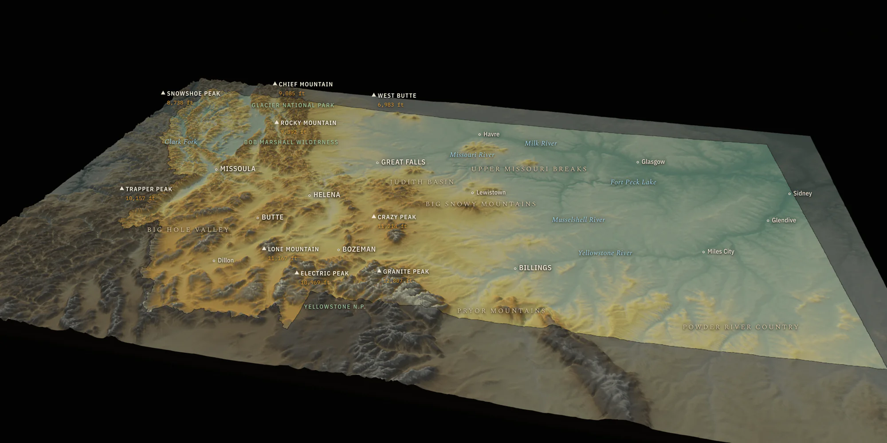

## gold — *The Gold Regions, 1865*

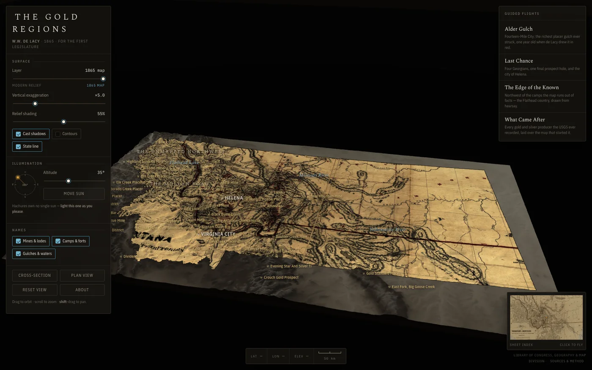

W.W. de Lacy's map of Montana Territory, drawn for its First Legislature in
the winter of 1864–65 — *"showing the gulch or placer diggings actually
worked, and districts where quartz (gold & silver) lodes have been
discovered to January 1st 1865"* — scanned at 8,984 × 6,634 px by the
[Library of Congress](https://www.loc.gov/item/2006629609/).

The sheet draws no internal graticule, only degree ticks along its borders
(Greenwich longitudes above, Washington longitudes below). Tick combs solve a
similarity; the degree labelling is chosen automatically as the one that lays
the surveyed state boundary along de Lacy's heavy red territory line — they
agree to 98 %, and the bottom border yields the sheet's own prime meridian
(de Lacy put Washington at 77°05′ W of Greenwich). Residual across 27 ticks:
about **5 px**. East of the divide his boundary tracks the modern survey
almost perfectly; in the northwest the fit exposes his guesswork, which is
the story. The terrain, grid and state-line mask are shared with `montana/`
verbatim — same state, same conic.

Special to this sheet: a *Mines & lodes* layer — four hundred gold and silver
producers from the USGS [MRDS](https://mrdata.usgs.gov/mrds/) database,
fetched over WFS at build time — over the map that started the rush. And the
middle crossfade stop is **de Lacy's original manuscript**, pen and pencil on
linen (Montana Historical Society), registered to the print by correlation —
where the two disagree by miles, you are watching him revise Montana between
draft and stone.

## missouri — *The Head of Navigation*

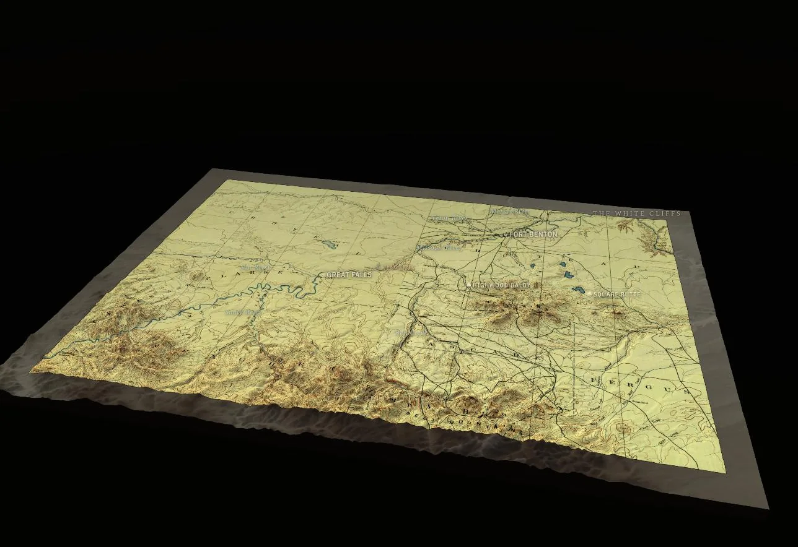

The Missouri where it earned its keep: the **Great Falls (1886) and Fort
Benton (1890) degree sheets** joined at 111°W — the five falls by name, the
portage plain, Decision Point at the Marias mouth, and the levee at the
head of steamboat navigation — with **Mortson's 1890 Official Map of
Cascade County** (the Belt Mountains' coal and silver workings coloured in)
one slider-stop behind, anchor-seeded from Great Falls and Neihart and
correlated at ~1 km. The river's own landmarks ride the terrain under an
anchor glyph (⚓): falls, springs, landings, and the levee itself. Four
flights run from the five falls to the edge of the White Cliffs, and the
*Head of Navigation* flight says plainly what the levee's ledger carried.

## paradise — *The Livingston Sheet*

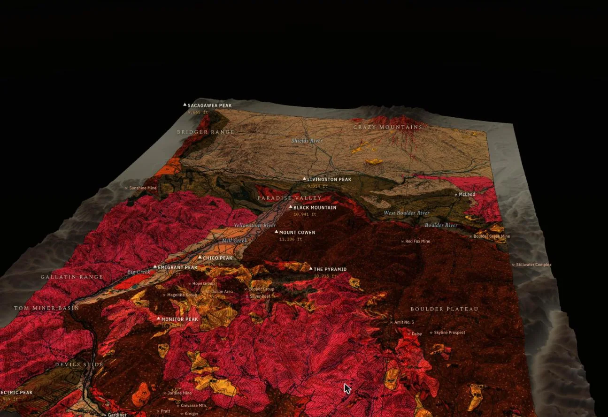

**Folio No. 1 of the Geologic Atlas of the United States** (Livingston,
Montana, 1894; geology by Iddings & Weed, topography by Frank Tweedy,
1883–86) — the full degree of country between the Northern Pacific main
line and the park boundary: Paradise Valley with the Park Branch drawn down
it, Tom Miner Basin and the Gallatin Petrified Forest, Yankee Jim Canyon,
Emigrant Gulch, McLeod and the Boulder to the Independence camp, and the
Crazy Mountains' radial dike swarm bursting off the north edge. The east
margin still carries the Crow Reservation boundary as it stood in 1891 —
the About panel says what that line meant.

The folio plate is registered to the **1891 degree-sheet edition** (HTMC,
already georeferenced, 200-ft contours — also the middle crossfade stop) by
correlation on the shared-ink high-pass mask: **1.9 px RMS ≈ 40 m** on 119
control points. Forty-four recorded gold, silver, lead and copper producers
from MRDS ride the terrain; ten summits are GNIS-placed and DEM-verified.

## yellowstone — *Yellowstone in Folio*

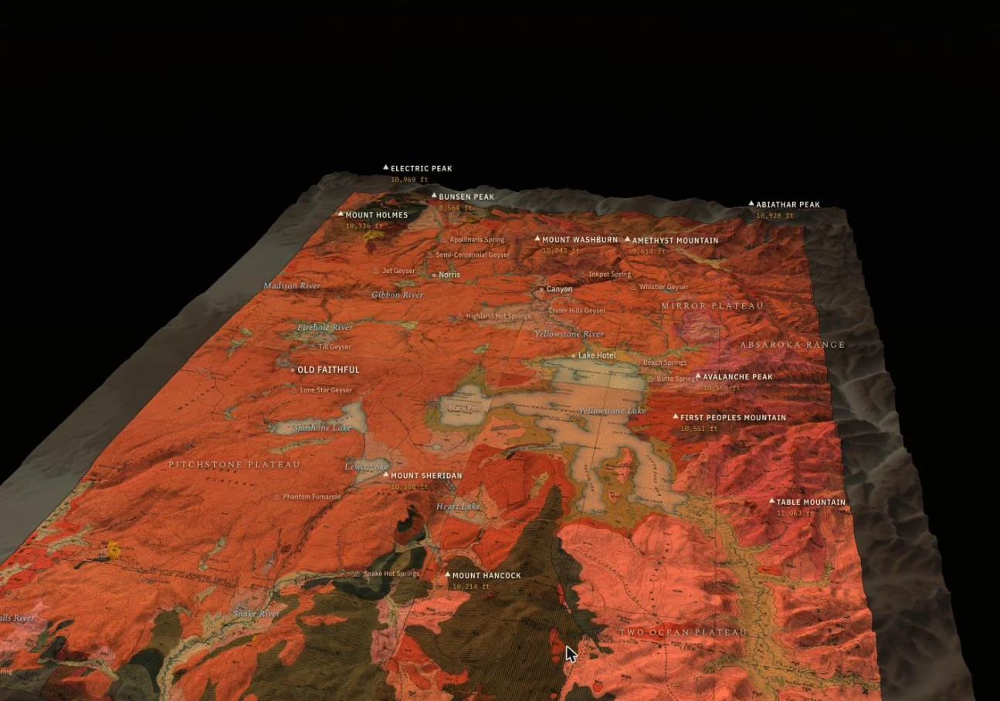

Arnold Hague's geologic folio of Yellowstone National Park (Geologic Atlas
of the United States, Folio 30, 1896) — the four 30-minute quadrangles,
*Gallatin*, *Canyon*, *Shoshone* and *Lake*, mosaicked into one 1° × 1°
drape: orange rhyolite edge to edge, Absaroka breccias, white geyser sinter,
and no idea yet of the caldera all of it fills. The middle crossfade stop is
the **1911 engraved topography** of the same four quadrangles (USGS
Historical Topographic Map Collection, each carrying its own polyconic
georeference).

Each folio plate is rasterised from the pubs.usgs.gov PDF and registered to
its own 1911 base by correlation — but on a **local high-pass ink mask**
rather than the black+blue mask the other sheets use: the linework these
editions share is the brown contour plate, invisible to a colour test under
the folio's washes. On shared ink the four fits land at **1.5–2.2 px RMS ≈
16–23 m**, the tightest georeference in the gallery (78–90 control points
per sheet). Seventy named geysers and hot springs from GNIS ride the terrain
as data (♨), famous names first; thirteen summits are placed from GNIS
coordinates and verified against the elevation model.

## glacier — *Glacier in Contours*

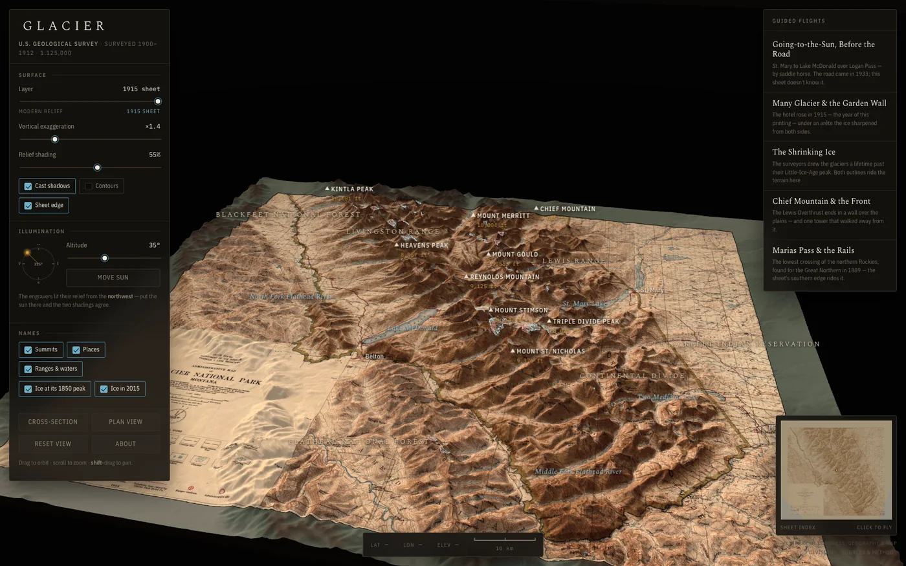

The USGS-engraved topographic sheet of Glacier National Park — 100-ft
contours and hand-laid relief from the surveys of 1900–1912; this is the
Interior Department's 1915 administrative printing, scanned at 9,788 × 8,492
px by the [Library of Congress](https://www.loc.gov/item/2016586564/).
Going-to-the-Sun Road does not exist on it.

The sheet is registered against the survey's own 30-minute quadrangles —
Chief Mountain (1904), Kintla Lakes (1906), Nyack (1914), Marias Pass (1913),
which the USGS distributes already georeferenced. The 49th-parallel boundary
line seeds the alignment; shared linework (black culture, blue drainage) is
matched by image correlation at two scales, giving 38 control points.
Residual: **2.2 px median, 2.7 px RMS** — about 30 m on the ground.

Special to this sheet: the park's named glaciers ride the terrain as vector
overlays — their Little-Ice-Age maxima and their 2015 outlines, from USGS
ScienceBase — beside the ice the surveyors drew. The layer slider also passes
through **Ross's 1959 reconnaissance geologic map** (Professional Paper 296,
plate 1): the Lewis Overthrust in colour, registered to the sheet by
correlation.

## bitterroot — *The Bitterroot*

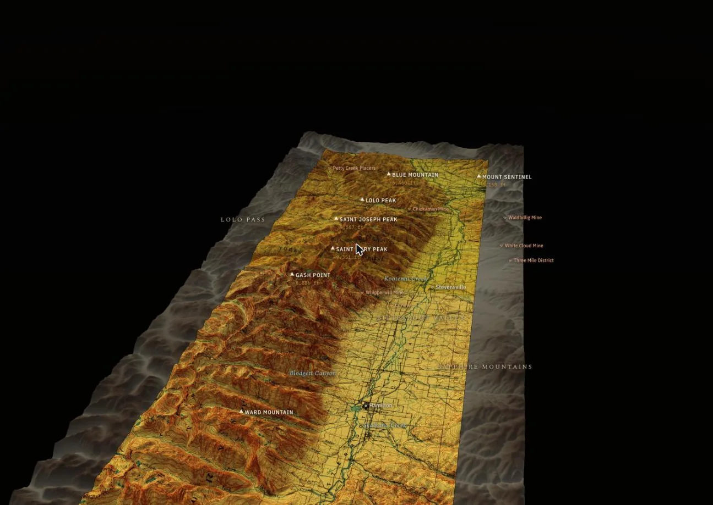

The **Hamilton (1901) and Missoula (1912) quadrangles** joined at 46°30′ —
the Bitterroot Valley end to end, from the Como moraines to the Hellgate,
with the 1912 sheet ending literally at Missoula's doorstep. The middle
crossfade stop is **J.B. Leiberg's 1898 Bitterroot Forest Reserve
land-classification map** (USGS 20th Annual Report): board-feet in greens,
burns in hatching, the valley's farms in orange. Leiberg's plate is a
sketch-contour compilation, so it is anchor-seeded from the printed symbols
of Stevensville and Hamilton (the flathead sheet's move) and refined by
correlation where the valley's grid and drainage hold — **7.4 px ≈ 150 m**.
Five flights run from Travelers' Rest and Fort Fizzle to St. Mary's Mission
— and the About panel states plainly what happened to the Bitterroot Salish
in 1891. Look for Glacial Lake Missoula's strandlines on Sentinel and Jumbo.

## front — *The Rocky Mountain Front*

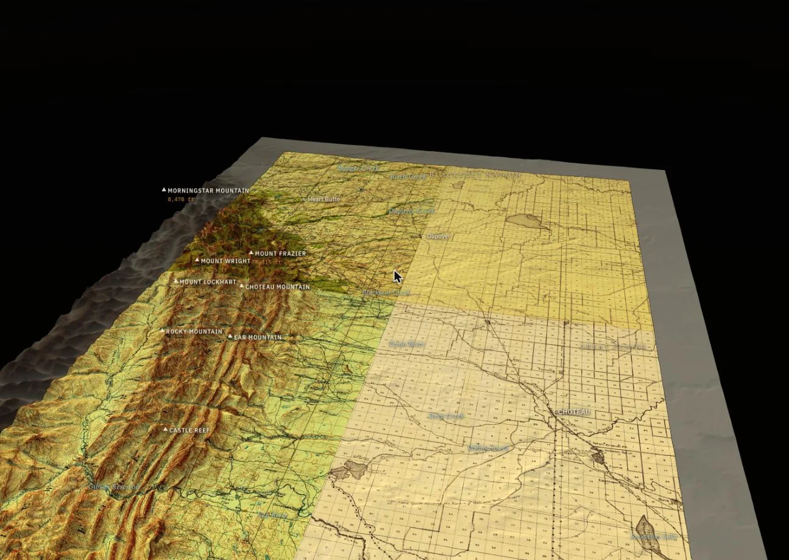

Four quadrangles tiled into one degree of the Front — **Saypo (1903),
Choteau (1920), Heart Butte (1918), Dupuyer (1920)** — the overthrust wall
the Blackfeet call **Miistákis, the Backbone of the World**: reef after
reef of thrust limestone against the ruled township grid of the wheat
bench, with the Blackfeet Nation across the sheet's north half. The middle
stop is **H.B. Ayres' 1899 Lewis and Clark Forest Reserve map** ("GREAT
PLAINS (TREELESS)" sweeping its east half) — a reconnaissance at sketch
scale that sits about a mile from the surveyed quads, which the About panel
says out loud. The modern terrain carries Gibson Reservoir (1929) where the
1903 sheet drew only the river; the mismatch is left in plain sight. Four
flights: the reefs, the Old North Trail, Sun River, and the Teton.

## rails — *Montana by Rail*

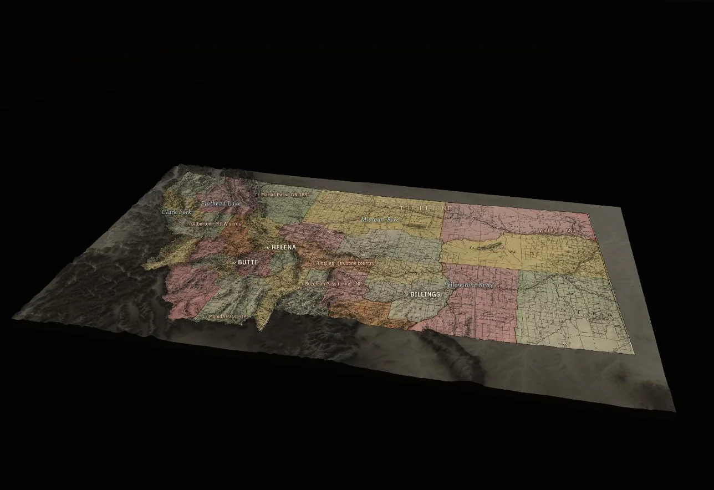

Two railroad maps of the whole state on one slider, on the montana sheet's
own grid and terrain: **Rand McNally's 1912 New Commercial Atlas map**
(four transcontinental routes, the branch web, electric lines in the
legend) over **Cram's 1884 Railroad and County Map of Montana Ty.** (the
Northern Pacific one year old and nearly alone). Neither map trusts its own
projection: each is seeded from two printed townsites and correlated
against the 1991 relief sheet's drape on shared drainage ink — the 1912
atlas spread fitted page by page and **rejoined at its binding fold**
(≈1.8 km per page, honest atlas accuracy), the 1884 territorial compilation
bent as far as a cubic will follow (~5 miles, period-honest, stated in the
About). Passes, tunnels and the Gold Creek last spike ride as data (∩);
five flights run from the last spike to the Milwaukee's electrics.

## flathead — *The Flathead Country*

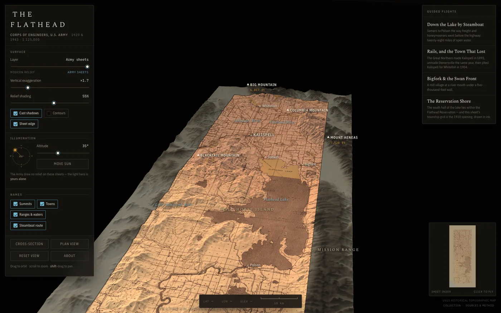

Flathead Lake and its valley — Somers, Bigfork, Kalispell, Whitefish — on two
sheets of the U.S. Army's **Progressive Military Map**: the *Flathead Lake*
quadrangle (advance sheet 146-N-E/2, printed 1920 on tan paper) and the
*Kalispell* quadrangle (1669:30/31, compiled 1919, Army Map Service printing
1943), from the [USGS Historical Topographic Map
Collection](https://ngmdb.usgs.gov/topoview/). Planimetric compilations from
GLO plats and forest atlases — no contours; a pencilled note on the 1920
sheet reads *"not mapped by USGS."*

Both scans carry their georeference (polyconic on NAD27, 10.58 m/px); the
pipeline datum-shifts the grid, crops each sheet to its neatline, tone-matches
the 1943 printing to the 1920 paper, and draws their join at 48°00′ as a
visible hairline — checked against a dozen townsites to within about one scan
pixel. The steamboat route from Somers to Polson rides the lake as an
overlay, and the About panel says plainly what the township grid on the
reservation half of the lake meant in 1910. The middle crossfade stop is
**Jaqueth & Walters' 1908 county map** (Montana Historical Society) — the
whole lake on one sheet, registered to the Army quads at about 4 px ≈ 200 m.

## libby — *The Libby Quadrangle*

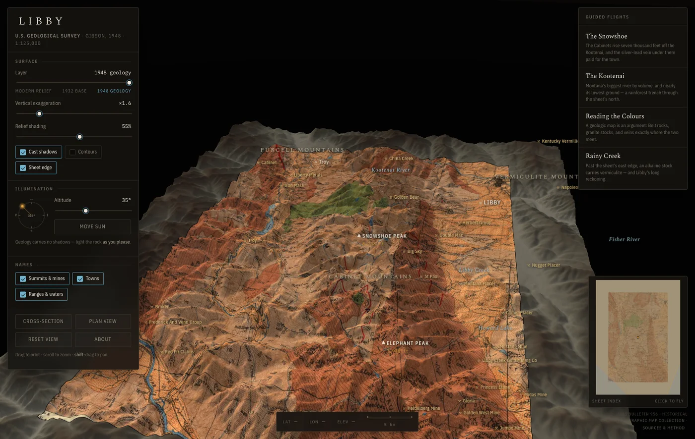

Russell Gibson's geologic map of the Libby 30-minute quadrangle (USGS
Bulletin 956, plate 1, 1948) — the Cabinet Mountains' Belt rocks, granite
stocks and the silver-lead veins south of Libby, keyed to a printed *List of
Mines* — rasterised from the bulletin PDF and registered by correlation
against the **1932 topographic base it was printed on** (USGS Historical
Topographic Map Collection, already georeferenced), which also rides the
slider as the middle layer. Fifty recorded gold, silver, lead, copper and
zinc producers from MRDS plot over the geology that explains them; the
*Rainy Creek* flight says plainly what the 1948 sheet could not yet know
about vermiculite and asbestos.

## beyond Montana — tacoma, coeurdalene, silverton, nome

Four sheets carry the gallery over the state line, built by the same
pipelines from the same kinds of sources — each a folio or survey
publication registered against (or fitted like) the Survey's own
georeferenced base:

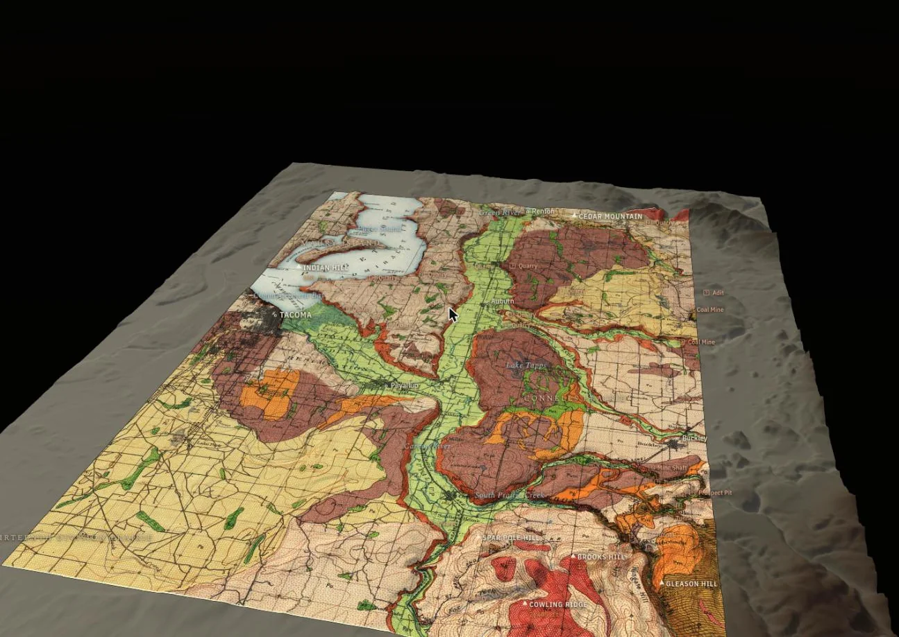

**`tacoma/` — *Tacoma: Ice and Iron* (WA).** Bailey Willis's Folio 54
Historical Geology sheet (1899) reads the Vashon ice sheet's work under
Puget Sound — the gallery's first sheet with the sea in it — over the
Northern Pacific's terminus country, with the 1900 Gannett/Rankine
timber-classification plate one stop behind (1.0 / 2.6 px vs the 1897
quad) and the Wilkeson–Carbonado coal district riding as data. The
About and *The Terminus* flight state plainly that this is Puyallup and
Nisqually country and what the Medicine Creek Treaty set in motion.

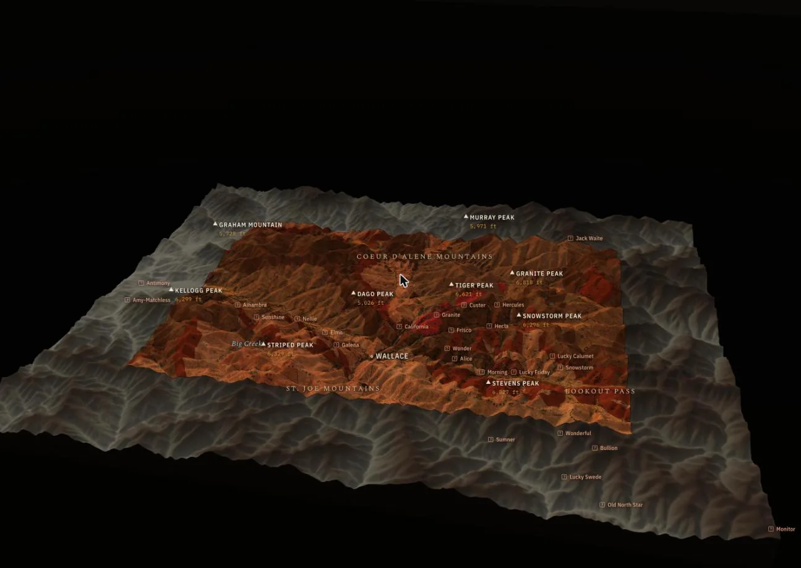

**`coeurdalene/` — *The Coeur d'Alene* (ID).** Professional Paper 62
(Ransome & Calkins, 1908): the richest silver-lead district in America,
its geology draped at 3.1 px over the Survey's own 1906 special map,
the great lodes — Bunker Hill, Sunshine, Hercules — strung down the
South Fork, with flights for the 1892/1899 labor wars and the Big Burn
of 1910, said plainly.

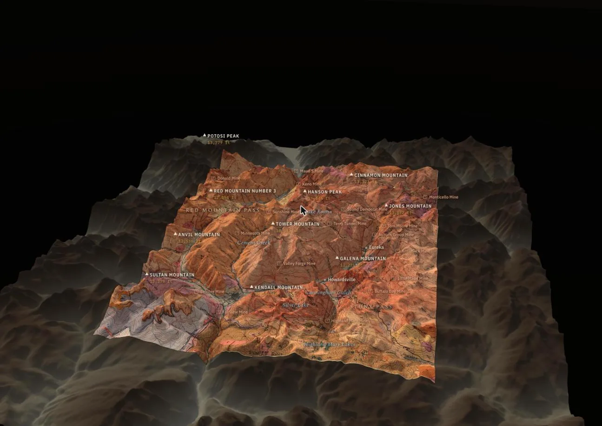

**`silverton/` — *The Silverton Folio* (CO).** Folio 120's economic
sheet (Cross, Howe & Ransome, 1905) — every vein, tunnel and mill of
the San Juan caldera country at 4.1 px over the 1901 quad, its areal
geology one crossfade behind, eighty mines riding 13,000-ft terrain,
the D&RG narrow gauge and the 1873 Brunot Agreement both in the
flights.

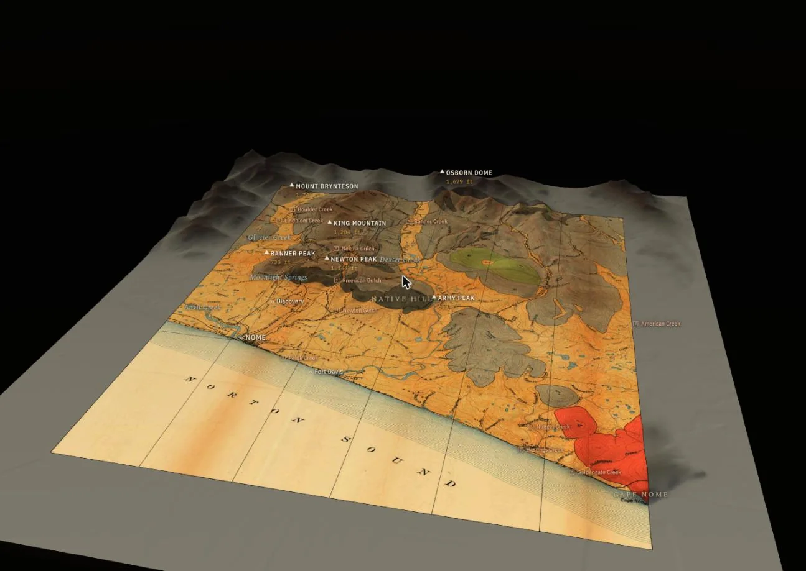

**`nome/` — *Nome, the Golden Beach* (AK).** Bulletin 533's 1913
geology over its 1904 topography, fitted from all twenty-eight printed
graticule crossings (~2 px internal; the 1904 datum's offset against
the modern grid is stated, not hidden) — the beach placers, the
roadstead trade, the Wild Goose Railroad, and the Iñupiaq homeland it
all stands on.

## art — *The Flat Wing*

Bird's-eye views, panoramas, brochure maps and town plans that cannot
honestly be draped — presented as the pictures they are, each linked to its
holding archive: Renshawe's 1914 painted panorama of Glacier (AGSL), the
Great Northern's *Aeroplane View* (1914), the NPS Peace Park guide maps
(1937/1948), Ayres' 1899 forest-reserve classification plate, the USFS
Flathead National Forest map, the 1904 GLO sectionized map of the Flathead
Reservation — hung with its provenance said plainly — Sanborn
fire-insurance sheets for Kalispell (1910) and Bigfork (1916), and, from
the Yellowstone shelf: Raynolds' 1859–60 reconnaissance of the upper
Yellowstone (compiled by Hayden, the plateau still blank), the Hayden
Survey's 1871 map of the Upper Geyser Basin and 1878 park geology, the
1883 and 1884 bird's-eyes of brand-new Livingston and Missoula — and,
from the rails-and-rivers shelf, Clark's 1814 master map of the
expedition, the Northern Pacific's land-grant checkerboard, and the
Jawbone Railroad's own 1899 promotion.

## Controls

| | |
|---|---|
| drag | orbit |
| scroll | zoom toward the cursor |
| shift-drag | pan |
| **Cross-section**, then two clicks on the terrain | a profile between them; hover along the profile to run a marker down the line in 3-D |
| drag the sun dial — or focus it and use the arrow keys | move the light |
| click the sheet index, bottom right | fly to that corner of the sheet |
| <kbd>S</kbd> <kbd>C</kbd> <kbd>R</kbd> <kbd>P</kbd> | shadows · contours · reset view · plan view |
| <kbd>Esc</kbd> | end a flight, clear a cross-section, close the about panel |

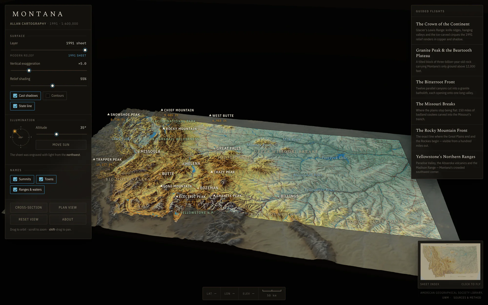

## Layout

```
LICENSE                        MIT — the code only, not the scans
assemble_all.py                builds every sheet + the gallery into dist/
docs/                          screenshots used by this README, and the
                               research plan behind the expansion
lib/                           shared pipeline modules (projections, datums,
                               Terrarium DEM, georeferencing fits, encoders)
work/dem/                      Terrarium tile cache shared by all sheets
                               (gitignored)
art/                           the Flat Wing — a static typeset page
                               (pipeline downsizes the scans, assemble
                               writes dist/)
<sheet>/                       montana, missouri, paradise, yellowstone,
                               glacier, bitterroot, front, rails, flathead,
                               gold, libby:
  <sheet>.html                 one-file build — just open it
  assets/                      drape.webp, height.webp, meta.json, card.webp
                               — plus alt.webp where a sheet carries a second
                               historical layer (committed; regenerating
                               pulls big downloads)
  src/                         body.html, style.css, app1.js, app2.js,
                               assemble.py
  pipeline/                    build.py, places.py
  requirements.txt
vercel.json                    build assemble_all.py, serve dist/
```

The newer sheets share one viewer chassis (`app1.js`/`app2.js` are
copies with all scale-dependent constants derived from the plate size, and
overlays, mines and UI defaults data-driven from `meta.json`); `montana/`
keeps its original code untouched. Height is decoded on the CPU into a
half-float RG texture (elevation in R, signed distance to the sheet or state
line in G) so the GPU can filter it.

`assets/` are committed even though they are generated: rebuilding them pulls
hundreds of MB and wants the scientific-Python stack, and the whole point of
the one-file builds is that they work for someone who wants neither.

## Rebuilding

```bash
pip install -r <sheet>/requirements.txt    # numpy, scipy, pillow, pyshp, pypdfium2
cd <sheet>
python3 pipeline/build.py     # fetches scans, DEM tiles, fits, re-encodes
python3 src/assemble.py       # writes the one-file build and dist/
python3 -m http.server -d dist 8000
```

With twenty-six cards the stdlib server serialises image requests and the
gallery fills in slowly; any threaded static server (or `vercel dev`)
loads it at once. The sheets themselves are unaffected — each is one
self-contained file.

Each `build.py` runs named stages (`fetch`, `georef`, `resample`, `encode` —
montana's differ slightly) that cache into `work/`; name a stage to start
there. DEM tiles cache once for all sheets in `work/dem/` at the repo root.
Every pipeline prints its fit residuals and writes QA overlays into `work/`
so you can see the georeference laid over the scan.

`assemble.py` fetches three.js r155 into `vendor/` on first run.

The newer sheets share one viewer chassis: `flathead/src/app{1,2}.js` is
the source of truth — edit there and copy to the other sheets (`montana/`
keeps its own diverged copy). Everything an agent or contributor needs to
build a new sheet — the registration playbook, the source cookbook, the
quality gates — lives in [AGENTS.md](AGENTS.md).

## Deploying

`vercel.json` builds the whole gallery. `assemble_all.py` is pure standard
library — Vercel runs it, gets `dist/`, and serves the landing page at the
root with each sheet at `/montana/`, `/missouri/`, `/paradise/`,
`/yellowstone/`, `/glacier/`, `/bitterroot/`, `/front/`, `/rails/`,
`/flathead/`, `/gold/`, `/libby/`, the state sheets at `/tacoma/`,
`/coeurdalene/`, `/silverton/`, `/nome/`, and the Flat Wing at `/art/`:

```bash
vercel        # preview
vercel --prod
```

Any other static host works the same way: run `python3 assemble_all.py` and
upload `dist/`.

## Rights

The code here is yours: [MIT](LICENSE). The scans belong to their libraries:

- *Montana in Relief*: American Geographical Society Library, University of
  Wisconsin–Milwaukee — see their
  [rights statement](https://uwm.edu/libraries/digital-collections/copyright-digcoll/)
  before reusing the scan or anything derived from it.
- *Glacier in Contours* and *The Gold Regions*: Library of Congress,
  Geography and Map Division — "free to use and reuse."
- *The Flathead Country* and *The Libby Quadrangle*: USGS Historical
  Topographic Map Collection and USGS Bulletin 956 — U.S. government works,
  public domain.
- *Yellowstone in Folio* and *The Livingston Sheet*: USGS Geologic Atlas
  Folios 30 and 1, with the 1911 quadrangles and the 1891 degree sheet from
  the HTMC — U.S. government works, public domain; names from GNIS.
- *The Bitterroot* and *The Rocky Mountain Front*: HTMC quadrangles with
  Leiberg's and Ayres' forest-reserve plates from the USGS 20th/21st Annual
  Reports — U.S. government works, public domain.
- *Montana by Rail* and *The Head of Navigation*: Cram 1884, the 1890
  Cascade County map and the Jawbone/land-grant/Clark wing pieces from the
  Library of Congress; the 1912 Rand McNally from the Internet Archive,
  scan via the David Rumsey Map Collection (the works are public domain by
  age); degree sheets from the HTMC.
- The state sheets: USGS Folio 54, Professional Paper 62, Folio 120 and
  Bulletin 533 with their HTMC bases; the 21st Annual Report timber plate;
  wing pieces from LOC — U.S. government works and expired-term
  lithographs, public domain throughout.
- Second layers: PP 296 plate 1 (USGS, public domain); Jaqueth & Walters 1908
  and the de Lacy manuscript — Montana History Portal (Montana Historical
  Society), items marked "copyright not evaluated" but public domain by age.
- The Flat Wing: all pieces are public-domain works held by AGSL, LOC, NPS,
  USGS and the Montana History Portal; the 1914 *Aeroplane View* scan comes
  via the David Rumsey Map Collection's Internet Archive uploads and carries
  their credit request.
- Glacier margins: USGS NOROCK via ScienceBase; mines: USGS MRDS; elevation
  tiles: [Terrarium, open data](https://registry.opendata.aws/terrain-tiles/);
  boundaries: US Census. All public domain.

The research that chose these sheets — with a much longer list of candidates,
sources and archives — is in
[docs/expand-montana-plan.md](docs/expand-montana-plan.md).
